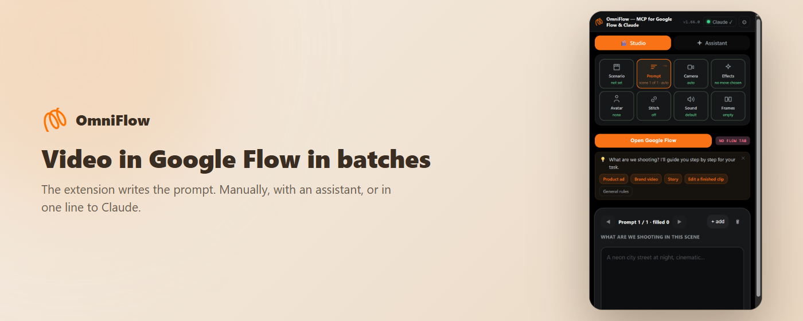

# OmniFlow MCP — Google Flow (Veo 3 / Omni 1.1) automation for Claude

[](https://chromewebstore.google.com/detail/omniflow-%E2%80%94-mcp-for-google/kljcdogggnjabpcffmbjbpaeahmkinik)
[](https://chromewebstore.google.com/detail/omniflow-%E2%80%94-mcp-for-google/kljcdogggnjabpcffmbjbpaeahmkinik)
[](https://www.npmjs.com/package/omniflow-mcp)
[](https://www.npmjs.com/package/omniflow-mcp)
[](LICENSE)

**Google Flow has no API.** This MCP server gives Claude Code and Claude Desktop hands inside Google Flow: batch video generation on Veo 3 / Omni 1.1, keyframe transitions, scene chaining, video-to-video edits and auto-download — on the Google AI plan you already pay for. No per-second billing, no API keys.



> *You, in Claude:* «Make a 40-second hotel promo from the photos in `C:/promo`, vertical, logo at the end.»
> *Claude, through OmniFlow:* `flow_status` → `flow_generate` (5 scenes, keyframe pairs) → `flow_wait`
> ✓ 5 clips saved to `omniflow-out/HotelPromo/`

## How it works

```
Claude Code / Claude Desktop
        │  MCP (stdio, JSON-RPC)
        ▼
  omniflow-mcp  ──  local bridge on 127.0.0.1:8787  ──  files → omniflow-out/
        ▲  HTTP, polled every few seconds
        │
  OmniFlow Chrome extension  ──►  Google Flow tab (labs.google/fx/tools/flow)
```

The MCP server (this repo) is pure transport: five tools and a local HTTP bridge, zero dependencies. The **OmniFlow Chrome extension** does the actual work in the Flow tab — it types the prompts, sets model / aspect / length, attaches references and keyframes, waits for the render and downloads the clips with clean numbered names. On connect, the extension hands the bridge its *director playbook* (dramaturgy map, camera moves, product presets, chaining recipe, sound layers); `flow_status` passes it to Claude, so Claude behaves like a director, not a typist.

## Quick start

**1. Install the extension** — [OmniFlow in the Chrome Web Store](https://chromewebstore.google.com/detail/omniflow-%E2%80%94-mcp-for-google/kljcdogggnjabpcffmbjbpaeahmkinik). First 24 hours are free, no key and no card.

**2. Add the MCP server.**

Claude Code:

```bash
claude mcp add omniflow -- npx -y omniflow-mcp
```

> **Windows:** if PowerShell refuses to run `claude.ps1` / `npm.ps1` (script execution policy), call the `.cmd` shims instead: `claude.cmd mcp add omniflow -- npx.cmd -y omniflow-mcp`.

> No npm? The same server runs straight from GitHub: `npx -y github:DanikVR/omniflow-veo-mcp`.

Claude Desktop — add to `claude_desktop_config.json`:

```json
{
  "mcpServers": {
    "omniflow": { "command": "npx", "args": ["-y", "omniflow-mcp"] }
  }
}
```

**3. Open Google Flow** at [labs.google/fx/tools/flow](https://labs.google/fx/tools/flow) and enter a project. The extension icon in the Chrome toolbar shows *Claude ✓* when the bridge is connected.

**4. Talk to Claude.** It will ask two or three short questions (goal, platform, materials), propose scenarios, then shoot:

```
Make a 30-second ad for a thermal mug, vertical. Photos are in D:/mug. Logo at the end.
```

Clips land in `omniflow-out/<folder>/` next to where Claude was started (override with `OF_OUT`).

## Tools

| Tool | What it does |
|---|---|
| `flow_status` | Is the extension connected, is a Flow project open, what is queued — and `extension.director`, the playbook Claude follows. Call it first. |
| `flow_generate` | Queue one or many clips: prompt, model, aspect, length, variants, references, keyframe pair, chaining, library assets. Returns `jobId` at once. |
| `flow_wait` | Wait for a job and return the file paths. Polls every 5 s, up to `timeoutSec`. |
| `flow_edit` | Video-to-video edit of the last finished clip in the Omni 1.1 editor: background, weather, light, remove an object, restyle. |
| `flow_cancel` | Drop everything that has not started rendering. |

Full parameter reference: [docs/tools.md](docs/tools.md). The bridge also exposes a plain HTTP API on `127.0.0.1:8787` (`/health`, `/jobs`, `/jobs/:id`, `/cancel`) for scripts that are not MCP clients.

## Claude skills

`skills/` ships two Claude Code skills that turn Claude into a Flow director:

- **omni-director** — always on when the user wants a video: asks the right questions, picks camera moves and product presets, chains scenes, proposes edits after the render.
- **ad-video** — one line of brief → storyboard → keyframe pairs → English prompts → `flow_generate` / `flow_wait`.

Copy them into your project's `.claude/skills/` (or `~/.claude/skills/` for all projects). The skill bodies are currently in Russian; Claude reads them fine, an English edition is on the roadmap.

## What the extension adds

39 one-click cinematic presets (dolly zoom, crash zoom, 360° orbit, bullet time, FPV, hero product spin, levitation, liquid splash, whip-pan and match-cut transitions, logo finale), keyframe transitions first → last frame, scene chaining so the hero stays the same person from clip to clip, three sound layers, and a manual Studio panel plus an in-panel chat assistant for people who don't use Claude. Details, screenshots and pricing: [lingoflow.pro/omniflow](https://lingoflow.pro/omniflow?utm_source=github&utm_medium=readme&utm_campaign=omniflow-mcp).

## Security

- The bridge listens on `127.0.0.1` only. To reach it from another machine (Tailscale etc.) set `OF_HOST` and `OF_PORT`; then every request must carry the token from `~/.omniflow-token` (`x-omniflow-token` header).
- Only `chrome-extension://` origins may call the bridge; everything else gets 403.
- Nothing leaves your machine except what the extension itself sends to Google Flow. Prompts and clips stay on disk. The extension talks to lingoflow.pro only to validate its licence key.
- The extension presses the same buttons you would, with 25–70 s pauses between runs. No captcha bypass, no private API, no multi-accounting.

## Requirements

- Node.js 20 or newer.
- Chrome 116+ with the OmniFlow extension.
- A Google account with access to Google Flow (Google AI Pro or Ultra plan for meaningful volume).
- Claude Code or Claude Desktop.

## FAQ

**Does it work without the extension?** No. The MCP server is transport; generation happens inside your Google Flow tab through the extension.

**Is the extension free?** The first 24 hours after install are free without a key. Then a free week with a card, then €29/year or €79 once. Pricing lives on [the product page](https://lingoflow.pro/omniflow?utm_source=github&utm_medium=readme&utm_campaign=omniflow-mcp#pricing).

**Can I run the bridge on one machine and Claude on another?** Yes — `OF_HOST=0.0.0.0 OF_PORT=8787 npx -y omniflow-mcp` on the machine with Chrome, then point the extension's bridge URL (extension settings) to it and pass the token.

**Where do the files go?** `omniflow-out/` in the current working directory, or `OF_OUT=/path`.

## Links

- Product page and pricing: **[lingoflow.pro/omniflow](https://lingoflow.pro/omniflow?utm_source=github&utm_medium=readme&utm_campaign=omniflow-mcp)**
- Chrome Web Store: **[OmniFlow — MCP for Google Flow & Claude](https://chromewebstore.google.com/detail/omniflow-%E2%80%94-mcp-for-google/kljcdogggnjabpcffmbjbpaeahmkinik)**
- Questions, support, ideas: **[t.me/GuruAppSheet](https://t.me/GuruAppSheet)**
- Sister project for Dreamina / Seedance 2.5: [SeedFlow](https://lingoflow.pro/seedflow?utm_source=github&utm_medium=readme&utm_campaign=omniflow-mcp)

Русская версия: [README.ru.md](README.ru.md)

## Sources & thanks

The presets and prompt rules inside the extension and the skills were distilled from public Veo 3 / Google Flow prompting guides and open community repositories, then verified on live generations. If you recognise your work and want a credit line here, open an issue — it will be added.

## License

MIT © DanikVR. The OmniFlow Chrome extension is a separate, licensed product.
